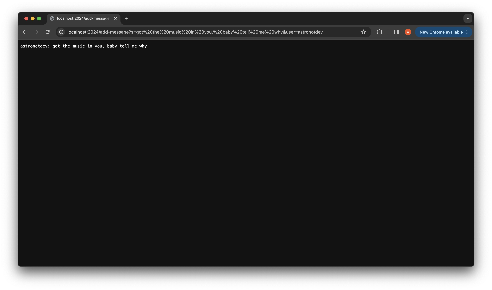
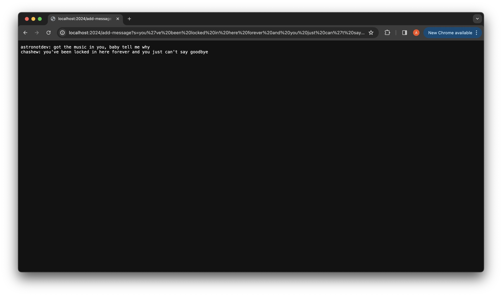
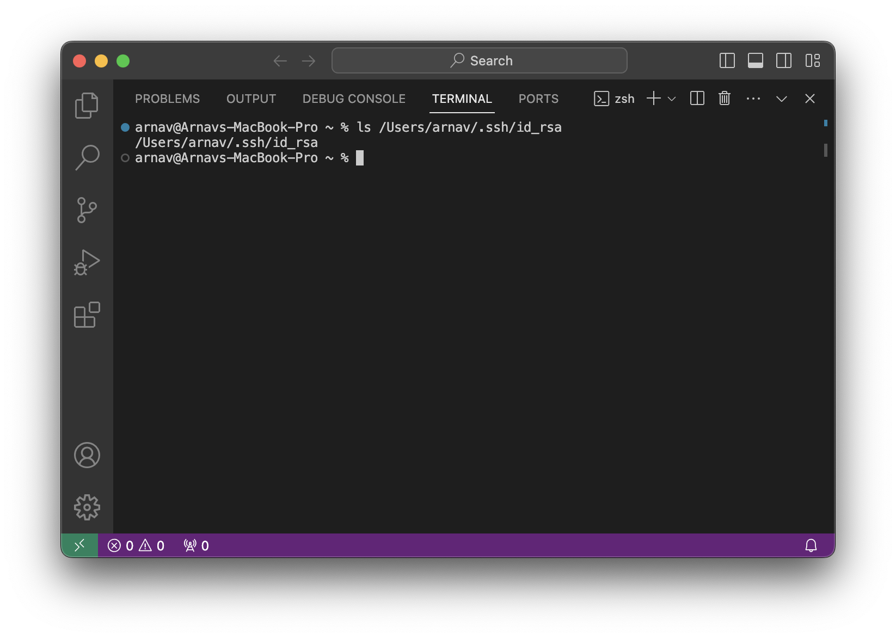
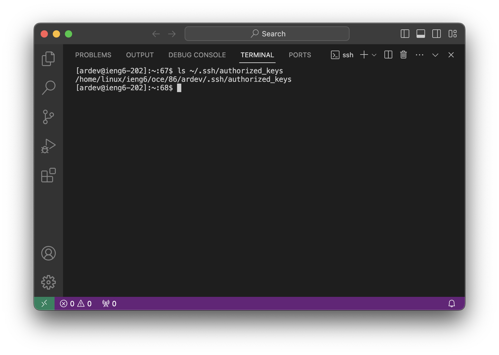
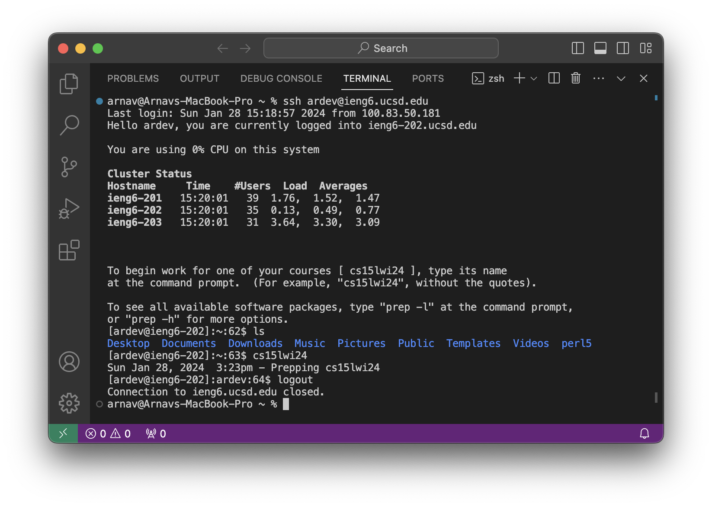

# Lab Report 2 - Servers and SSH Keys (Week 3)
<br/><br/> 
## Part 1
```java
import java.io.IOException;
import java.net.URI;


class Handler implements URLHandler {
    String openingText="Welcome to ChatServer";
    String chatString="";

    public String handleRequest(URI url) {
        if (url.getPath().equals("/")) {
            return String.format(openingText);
            } 
        else if (url.getPath().contains("/add-message")) {
            String[] parameters= url.getQuery().split("=");
            int posOfAnd=0;
            for(int i=0;i<parameters[1].length();i++){
                if(parameters[1].charAt(i)=='&'){
                    posOfAnd=i;
                }
            }
            String currentUser= parameters[2];
            String currentChat= parameters[1].substring(0,posOfAnd);
            chatString= chatString+ currentUser+ ": "+ currentChat+ "\n";
            return String.format(chatString);
        } 
        else {
            return "404 Not Found!";
        }
    }
}

class ChatServer {
    public static void main(String[] args) throws IOException {
        if(args.length == 0){
            System.out.println("Missing port number! Try any number between 1024 to 49151");
            return;
        }

        int port = Integer.parseInt(args[0]);

        Server.start(port, new Handler());
    }
}
```
#### Variable description Table:

| **Name**         | **Type**     | **Description**                                                                                      |
| :--------------- |:-------------|:--------------------------------------------------------------------------------------------------   |
| `args`           | `String[]`   | To store the port number                                                                             |
| `url`            | `URI`        | To refer to the the url of the webpage                                                               |
| `openingText`    | `String`     | To store the message to be displayed when the path is just `/`                                       |
| `chatString`     | `String`     | To store the whole chat sequence,i.e, usernames and chats and new line characters in a single string |
| `parameters`     | `String[]`   | To store fragments of the current query by splitting the query with `=` character                    |
| `posOfAnd`       | `int`        | To store the position of `&` character in the current query                                          |
| `currentUser`    | `String`     | To extract and store the string for user from current query                                          |
| `currentString`  | `String`     | To extract and store the string for user from current query with the help of `posOfAnd`              |


#### Example 1 of using `/add-message`:
 
*  Firstly, when we enter the url, the `handleRequest(URI url)` method is called. The argument to this method is the url of the page-`http://localhost:2024/add-message?s=Got%20the%20music%20in%20you,%20baby%20tell%20me%20why?&user=astronotdev`. Since our url does contain `/add-message` portion, this else if condition becomes `true`.
*  `String[] parameters={ "s" , "got the music in you, baby tell me why&user" , "astronotdev" }`
*  `posOfAnd`= 38
*  `currentUser`= "astronotdev"
*  `currentString`= "got the music in you, baby tell me why"
*  `chatString`= "astronotdev: got the music in you, baby tell me why\n"

#### Example 2 of using `/add-message`:

*  Firstly, when we enter the url, the `handleRequest(URI url)` method is called. The argument to this method is the url of the page-`http://localhost:2024/add-message?s=you%27ve%20been%20locked%20in%20here%20forever%20and%20you%20just%20can%27t%20say%20goodbye&user=chashew
`. Since our url does contain `/add-message` portion, this else if condition becomes `true`.
*  `String[] parameters={ "s" , "you've been locked in here forever and you just can't say goodbye&user" , "chashew" }`
*  `posOfAnd`= 64
*  `currentUser`= "chashew"
*  `currentString`= "you've been locked in here forever and you just can't say goodbye"
*  `chatString`= "astronotdev: got the music in you, baby tell me why\nchashew: you've been locked in here forever and you just can't say goodbye\n"

<br/><br/> 
## Part 2
#### The absolute path to the _private key_ for my SSH key for logging into `ieng6`:


#### The absolute path to the _public key_ for my SSH key for logging into `ieng6`:


#### A terminal interaction where I log into my ieng6 account _without_ being asked for a password:



<br/><br/> 
## Part 3

Over week 2 and 3 I learnt a lot of things that I did not know before. A few of them are:-
* URL:
    
     URL stands for _Uniform Resource Locator_. URLs are used to navigate and locate information on the World Wide Web, allowing users to access websites, documents, images, videos, and other online resources. A URL consists of several components, including the protocol (such as HTTP or HTTPS), the domain name (or IP address), and the path to a specific resource (such as a web page or file) on a server.
  
* Remotely accessing your accounting using `ssh` command on terminal:

   `ssh` stands for _Secure Socket Shell_ or _Secure Shell_ is a network protocol that gives users, particularly system administrators, a secure way to access a computer over an unsecured network. SSH is commonly used for remote access to command-line interfaces on servers, allowing users to log into and execute commands on a remote machine as if they were physically present at that machine.

* Setting up _ssh keys_  for easy access to a server from a local device:

    Setting up _ssh keys_ for secure and convenient access to a server involves generating a key pair on your local device and then configuring the server to recognize your public key. We generate the ssh keys using `ssh-keygen` command which generates two keys-_public_ and _private_. We then connect to the server using our credentials and store the _public key_ that we generated on it so that the server recognizes the key and therfore our local device when we try to log into the server the next time onwards.
   

<br/><br/> 
