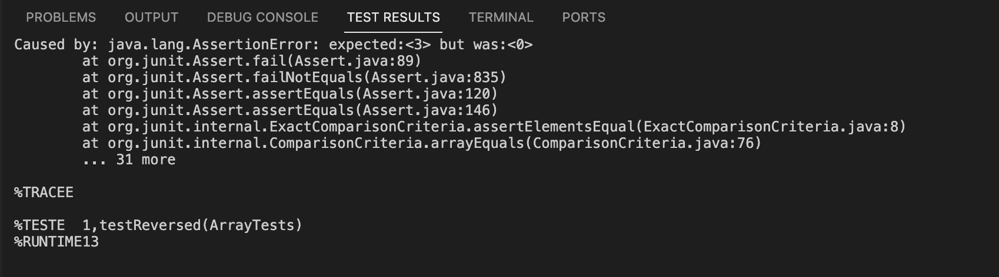
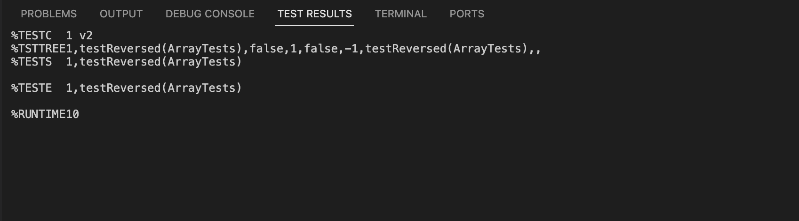

# Lab Report 3 - Bugs and Commands (Week 5)

## Part 1 - Bugs
For this part of the lab report I will be focussing on the following code excerpt from `ArrayExamples.java` file:
```java
public class ArrayExamples {
...
  // Returns a *new* array with all the elements of the input array in reversed
  // order
  static int[] reversed(int[] arr) {
    int[] newArray = new int[arr.length];
    for(int i = 0; i < arr.length; i += 1) {
      arr[i] = newArray[arr.length - i - 1];
    }
    return arr;
  }
...
}
```

* A failure-inducing input for the buggy program, as a JUnit test and any associated code
    ```java
       import static org.junit.Assert.*;
       import org.junit.*;

       public class ArrayTests {

       @Test
       public void testReversed() {
         int[] input1 = {1,2,3};
         assertArrayEquals(new int[]{3,2,1}, ArrayExamples.reversed(input1));
         assertArrayEquals(new int[]{1,2,3}, input1);
         }
      }
    ```
* An input that doesn't induce a failure, as a JUnit test and any associated code
    ```java
       import static org.junit.Assert.*;
       import org.junit.*;

       public class ArrayTests {

       @Test
       public void testReversed() {
         int[] input1 = { };
         assertArrayEquals(new int[]{ }, ArrayExamples.reversed(input1));
         assertArrayEquals(new int[]{ }, input1);
         }
      }
    ```
* The symptom, as the output of running the tests:
    * For the 1st test-block:
       
    * For the 2nd test-block:
       
* The bug, as the before-and-after code change required to fix it
    * Before
    ```java
       public class ArrayExamples {
       ...
         // Returns a *new* array with all the elements of the input array in reversed
         // order
         static int[] reversed(int[] arr) {
           int[] newArray = new int[arr.length];
           for(int i = 0; i < arr.length; i += 1) {
           arr[i] = newArray[arr.length - i - 1]; //This line is the bug, arr and newArray should be swaped
           }
         return arr; //This line is all the bug, newArray should be returned
         }
       ...
      }
    ```
    * After
    ```java
       public class ArrayExamples {
       ...
         // Returns a *new* array with all the elements of the input array in reversed
         // order
         static int[] reversed(int[] arr) {
           int[] newArray = new int[arr.length];
           for(int i = 0; i < arr.length; i += 1) {
           newArray[i] = arr[arr.length - i - 1];
           }
         return newArray; //This line is all the bug, newArray should be returned
         }
       ...
      }
    ```
  
<br/><br/>
## Part 2 - Researching Commands
<br/><br/>
